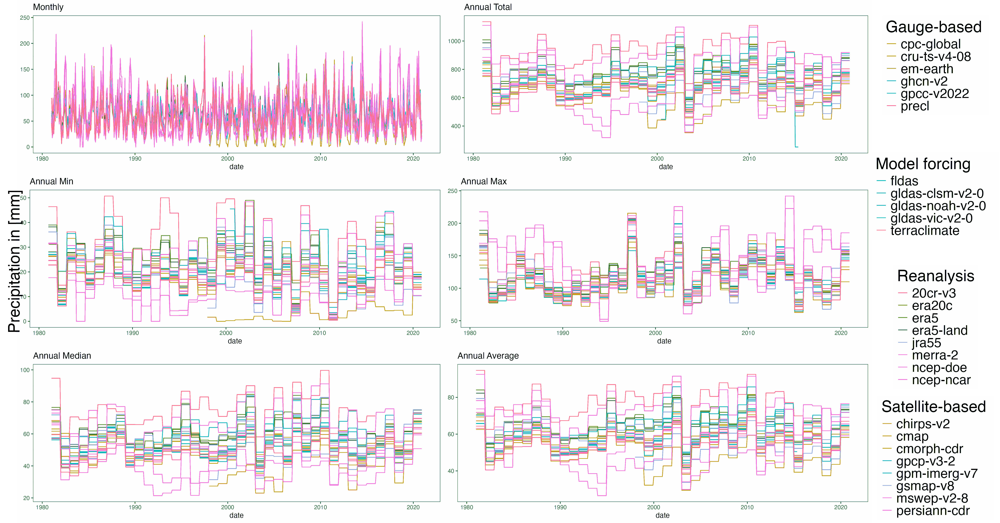
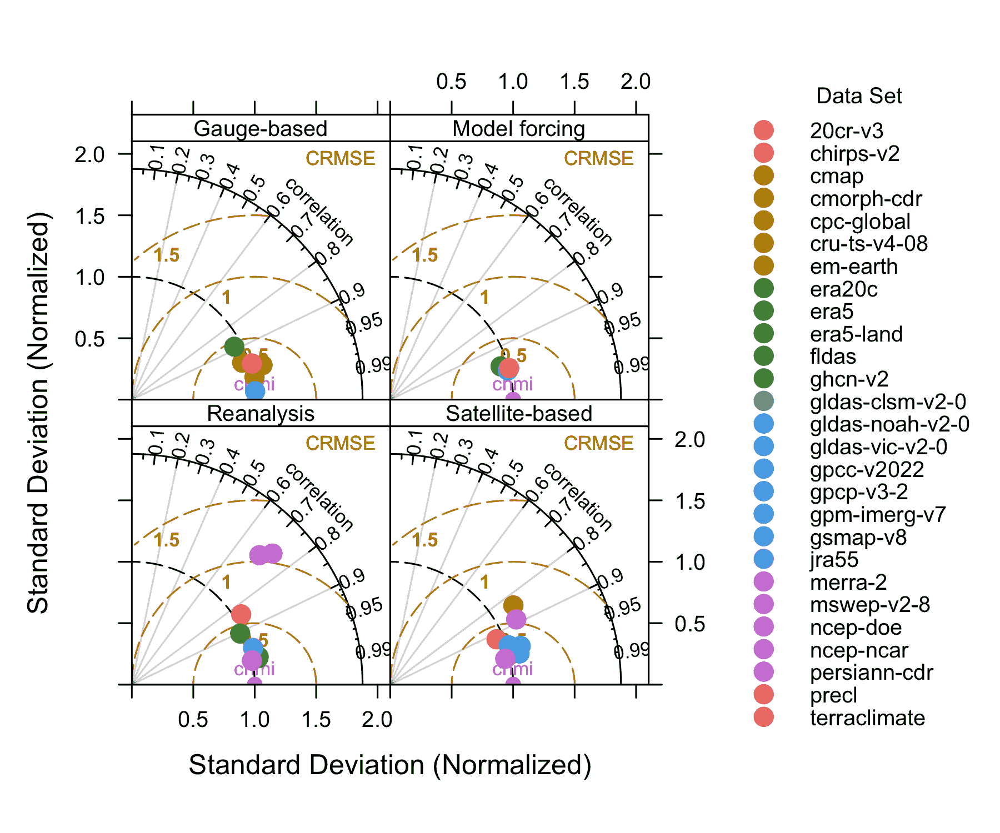
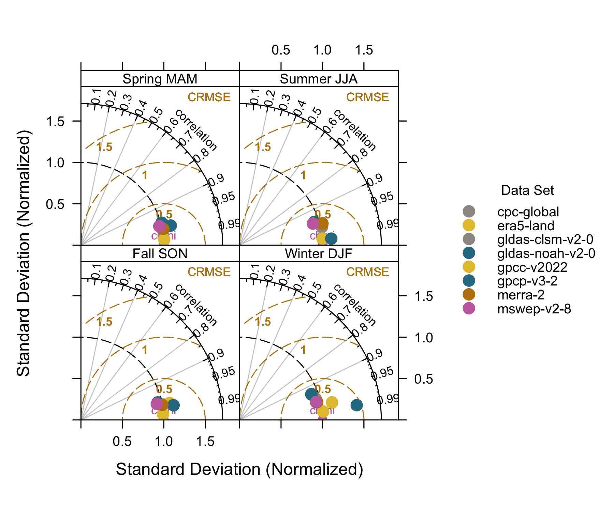
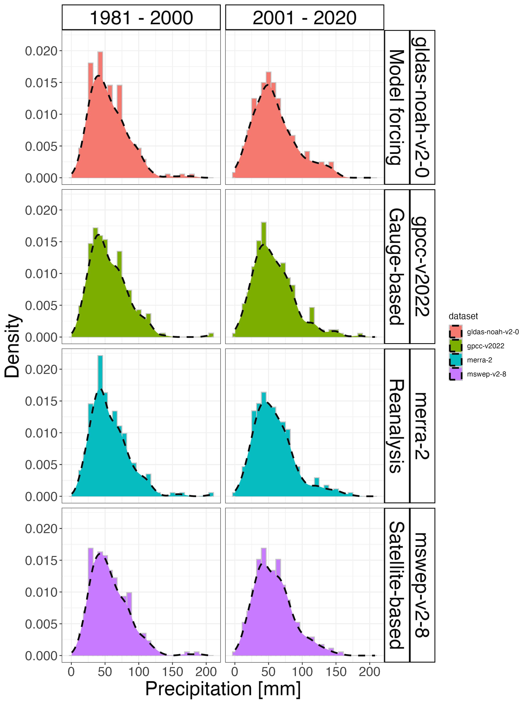
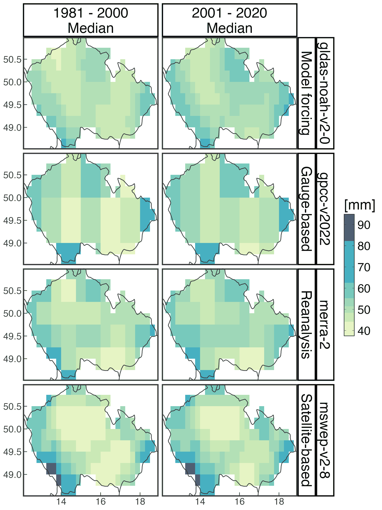

<style>
body {
text-align: justify}
</style>

***

```{r start, include = FALSE}
knitr::opts_chunk$set(
  echo = TRUE,
  eval = TRUE,
  fig.width = 7,
  warning = FALSE,
  message = FALSE
)
library(pRecipe)
library(kableExtra)
library(cowplot)
library(data.table)
library(foreach)
library(ggplot2)
library(ggpubr)
library(grid)
library(raster)
library(scales)
```

## Load required libraries

```{r, eval = FALSE}
library(cowplot)
library(data.table)
library(foreach)
library(ggpubr)
library(ggplot2)
library(grid)
library(kableExtra)
library(pRecipe)
library(raster)
library(scales)
```

## Data download

We download the entire collection with default parameters via `download_data()`, load data from the Czech Hydrometeorological Institute [CHMI](https://www.chmi.cz/?l=en), and define product groups by type.

```{r, eval = FALSE}
download_data()
prec_obs <- fread("chmi.csv")
prec_obs$dataset <- "chmi"
GAUGE_BASED <- c("cpc-global", "cru-ts-v4-08", "em-earth", "ghcn-v2",
                 "gpcc-v2022", "precl")
SATELLITE_BASED <- c("chirps-v2", "cmap", "cmorph-cdr", "gpcp-v3-2",
                     "gpm-imerg-v7", "gsmap-v8", "mswep-v2-8", "persiann-cdr")
REANALYSES <- c("20cr-v3", "era20c", "era5", "era5-land", "jra55", "merra-2",
                "ncep-doe", "ncep-ncar")
FORCINGS <- c("fldas", "gldas-clsm-v2-0", "gldas-noah-v2-0", "gldas-vic-v2-0",
              "terraclimate")
```


## Subset to spatiotemporal domain of interest

We then subsetted the downloaded data to the 1981-2020 period using the `subset_data()` function, and cropped it within the administrative borders of Czechia via the `crop_data()` function in conjunction with a [shape file](https://geodata.ucdavis.edu/gadm/gadm4.1/shp/gadm41_CZE_shp.zip) provided by the Database of Global Administrative Areas (GADM).

```{r, eval = FALSE}
prec_names <- list.files(full.names = TRUE)
prec_data <- foreach (dataset_count = 1:length(prec_names)) %do% {
  dummie_data <- subset_data(prec_names[dataset_count], box = c(11, 19, 46, 54),
                             yrs = c(1981, 2020)) %>% 
    crop_data("gadm41_CZE_0.shp")
  dummie_name <- sub(".*/([^_/]*)_.*", "\\1", prec_names[dataset_count])
  dummie_data@file@name <- dummie_name
  return(dummie_data)
  }
```

## Generate time series

We then generated time series using the `fldmean()` function. The time series were generated by computing the area-weighted average of all the grid cells of interest, and the values were stored in data.table objects with four columns: date, value, name, and source. The last two are mainly used for graphical aesthetics.

```{r, eval = FALSE}
prec_ts <- foreach (idx = 1:length(prec_data), .combine = rbind) %do% {
  dummie_data <- prec_data[[idx]]
  dummie_name <- dummie_data@file@name
  dummie_data <- fldmean(dummie_data)
  dummie_data$dataset <- dummie_name
  return(dummie_data)
}
prec_ts[dataset %in% GAUGE_BASED, source := "Gauge-based"
        ][dataset %in% FORCINGS, source := "Model forcing"
          ][dataset %in% REANALYSES, source := "Reanalysis"
            ][dataset %in% SATELLITE_BASED, source := "Satellite-based"]
```

## Compute annual statistics

Note that storing the time series in data.table objects enables further calculations with ease. Herein we calculated the sum, min, max, median, and mean of our monthly data by year in order to visually assess the similarities and discrepancies between data sources using the `plot_line()` function

```{r, eval = FALSE}
prec_ts[, asum := sum(value, na.rm = TRUE), by = .(year(date), dataset)
        ][, amean := mean(value, na.rm = TRUE), by = .(year(date), dataset)
          ][, amax := max(value, na.rm = TRUE), by = .(year(date), dataset)
            ][, amin := min(value, na.rm = TRUE), by = .(year(date), dataset)
              ][, amed := median(value, na.rm = TRUE), by = .(year(date), dataset)]
prec_ts$dataset <- as.factor(prec_ts$dataset)
```

## Line plots

It is evident at first glance that even limiting the data record to just 40 years, a line plot is not the best graphical aesthetic to represent our data due to the high clustering and overlapping of lines

```{r, eval = FALSE}
prec_color <- setNames(hue_pal()(length(unique(prec_ts$dataset))),
                       levels(prec_ts$dataset))
p01 <- ggplot(prec_ts, aes(x = date)) +
  geom_line(aes(y = value, color = dataset)) +
  scale_color_manual(values = prec_color, guide = 'none') +
  labs(y = NULL, title = 'Monthly') + theme_bw()
p02 <- ggplot(prec_ts, aes(x = date)) +
  geom_line(aes(y = asum, color = dataset)) +
  scale_color_manual(values = prec_color, guide = 'none') +
  labs(y = NULL, title = 'Annual Total') + theme_bw()
p03 <- ggplot(prec_ts, aes(x = date)) +
  geom_line(aes(y = amin, color = dataset)) +
  scale_color_manual(values = prec_color, guide = 'none') +
  labs(y = NULL, title = 'Annual Min') + theme_bw()
p04 <- ggplot(prec_ts, aes(x = date)) +
  geom_line(aes(y = amax, color = dataset)) +
  scale_color_manual(values = prec_color, guide = 'none') +
  labs(y = NULL, title = 'Annual Max') + theme_bw()
p05 <- ggplot(prec_ts, aes(x = date)) +
  geom_line(aes(y = amed, color = dataset)) +
  scale_color_manual(values = prec_color, guide = 'none') +
  labs(y = NULL, title = 'Annual Median') + theme_bw()
p06 <- ggplot(prec_ts, aes(x = date)) +
  geom_line(aes(y = amean, color = dataset)) +
  scale_color_manual(values = prec_color, guide = 'none') +
  labs(y = NULL, title = 'Annual Average') + theme_bw()

# Aux legends
gauge_legend <- ggplot(prec_ts[type == 'Gauge-based']) +
  geom_line(aes(x = date, y = value, color = dataset)) +
  scale_color_manual(values = prec_color, name = 'Gauge-based') +
  theme_bw() +
  theme(legend.text = element_text(size = 20),
        legend.title = element_text(size = 24))
model_legend <- ggplot(prec_ts[type == 'Model forcing']) +
  geom_line(aes(x = date, y = value, color = dataset)) +
  scale_color_manual(values = prec_color, name = 'Model forcing') +
  theme_bw() +
  theme(legend.text = element_text(size = 20),
        legend.title = element_text(size = 24))
reanalysis_legend <- ggplot(prec_ts[type == 'Reanalysis']) +
  geom_line(aes(x = date, y = value, color = dataset)) +
  scale_color_manual(values = prec_color, name = 'Reanalysis') +
  theme_bw() +
  theme(legend.text = element_text(size = 20),
        legend.title = element_text(size = 24))
satellite_legend <- ggplot(prec_ts[type == 'Satellite-based']) +
  geom_line(aes(x = date, y = value, color = dataset)) +
  scale_color_manual(values = prec_color, name = 'Satellite-based') +
  theme_bw() +
  theme(legend.text = element_text(size = 20),
        legend.title = element_text(size = 24))

plot_grid(plot_grid(p01, p02, p03, p04, p05, p06, nrow = 3, ncol = 2),
          plot_grid(get_legend(gauge_legend), get_legend(model_legend),
                    get_legend(reanalysis_legend),
                    get_legend(satellite_legend), ncol = 1),
          ncol = 2, rel_widths = c(5, 0.75)) %>%
  annotate_figure(left = textGrob("Precipitation in [mm]", rot = 90,
                                  vjust = 1, gp = gpar(fontsize = 24)))
```

{width=95%}

## Evaluating versus local reference
To evaluate data using local observations or one of the downloaded data sets as the reference, we can assess their correlation and variance through Taylor diagrams using the `plot_taylor()` function. We used data from the CHMI to evaluate the database in this case study.

```{r, eval=FALSE}
plot_taylor(prec_ts, prec_obs, cols = prec_color)
```

{width=95%}

As expected, observational data from gauge-based and satellite-based products are highly correlated with the CHMI reference, with most of their correlation coefficients above 0.95 and 0.9, respectively. In terms of variance, we observe that the hydrological model forcing data exhibits almost identical locations on the diagram. In contrast, reanalysis data are the most scattered of all four data sources. From this quick inspection, we can say GPCC v2022 data estimates are the closest to our evaluation reference, while NCEP/NCAR R1 and NCEP/DOE R2 are the most inconsistent (lowest correlation and highest variance).

### At the seasonal scale

Further insight into the validation of our data sets can be reckoned with by looking into their correlation and variance across different seasons. This time we looked only into eight data sets: CPC-Global, ERA5-Land, GLDAS CLSM v2.0, GLDAS NOAH v2.0, GPCC v2022, GPCP v3.2, MERRA-2 and MSWEP v2.8. Using high correlation to CHMI as a preliminary filter, we selected the two best data sets from each source. Visualizing the data sets' correlation by season, we discover that the best agreement with the CHMI reference occurs during Fall, where most data sets have a correlation above 0.95, normalized standard deviation around 1, and centered root mean square error 0.5.

```{r, eval=FALSE}
prec_8 <- prec_ts[dataset %in% c('gpcc-v2022', 'cpc-global', 'era5-land',
                              'merra-2', 'gldas-noah-v2-0', 'gldas-clsm-v2-0',
                              'gpcp-v3-2', 'mswep-v2-8')]
prec8_colors <- setNames(c("#999999", "#E69F00", "#56B4E9", "#009E73",
                           "#F0E442", "#0072B2", "#D55E00", "#CC79A7"),
                         unique(prec_8$name))
plot_taylor(prec_8, prec_obs, groups = 'seasons', cols = prec8_colors)
```


{width=95%}

## Assessing change between two periods

We can assess changes in precipitation regimes. We selected four data sets (GPCC v2022, MERRA-2, GLDAS NOAH v2.0, and MSWEP v2.8), we divided the time series in two 20-year periods (1981-2000 and 2001-2020), and examined their empirical distribution; to do so, we used the `plot_density()` function.

```{r, eval=FALSE}
prec_4 <- prec_ts[dataset %in% c('gpcc-v2022', 'merra-2', 'mswep-v2-8',
                                 'gldas-noah-v2-0')] %>%
  .[year(date) <= 2000, period := "1981 - 2000"] %>%
  .[year(date) > 2000, period := "2001 - 2020"]

plot_density(prec_4) +
  facet_grid(dataset + source ~ period) +
  theme(axis.text = element_text(size = 16), 
        axis.title = element_text(size = 24),
        strip.text = element_text(size = 24),
        strip.background = element_rect(fill = "white",
                                        color = "black", linewidth = 1))
```

{width=95%}

We identify two common traits: a density peak around 50 [mm] for the first 20-year period and a general widening of the density curve towards higher precipitation across the selected data sets in the last 20 years.

## Assessing spatial patterns of change between two periods

A different approach to analyzing changes in precipitation regimes is to explore their spatial patterns. We computed the median monthly precipitation at each grid cell for two 20-year periods, and then portrayed them using the `plot_map()` function.

```{r, eval=FALSE}
prec_grid <- lapply(prec_data, function(x) x@file@name %in% c('gpcc-v2022',
                                                              'merra-2',
                                                              'mswep-v2-8',
                                                              'gldas-noah-v2-0'))
prec_grid <- prec_data[which(prec_grid == TRUE)]
prec_grid <- foreach (dataset_count = 1:4, .combine = rbind) %do% {
  dummie <- prec_grid[[dataset_count]]
  dummie_name <- dummie@file@name
  dummie <- tabular(dummie) %>%
    .[year(date) <= 2000, period := "1981 - 2000\nMedian"] %>%
    .[year(date) > 2000, period := "2001 - 2020\nMedian"]
  dummie <- dummie[, .(value = median(value, na.rm = TRUE)),
                   by = .(lon, lat, period)]
  dummie$dataset <- dummie_name
  dummie
}

prec_grid[dataset %in% GAUGE_BASED, source := "Gauge-based"
          ][dataset %in% FORCINGS, source := "Model forcing"
            ][dataset %in% REANALYSES, source := "Reanalysis"
              ][dataset %in% SATELLITE_BASED, source := "Satellite-based"]


plot_map(prec_grid, timestamp = FALSE) +
  facet_grid(dataset + source ~ period) +
  theme(axis.text = element_text(size = 16), 
        axis.title = element_text(size = 24),
        strip.text = element_text(size = 24),
        strip.background = element_rect(fill = "white",
                                        color = "black", linewidth = 2))
```

{width=95%}


