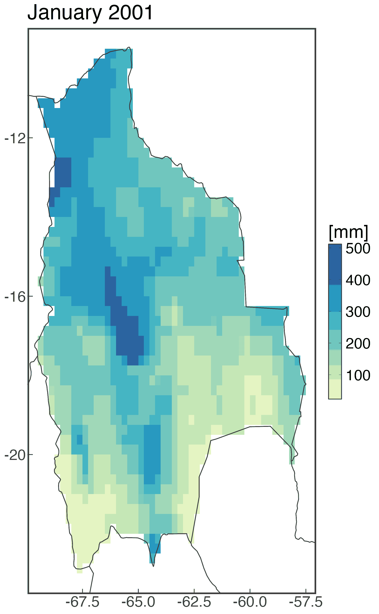
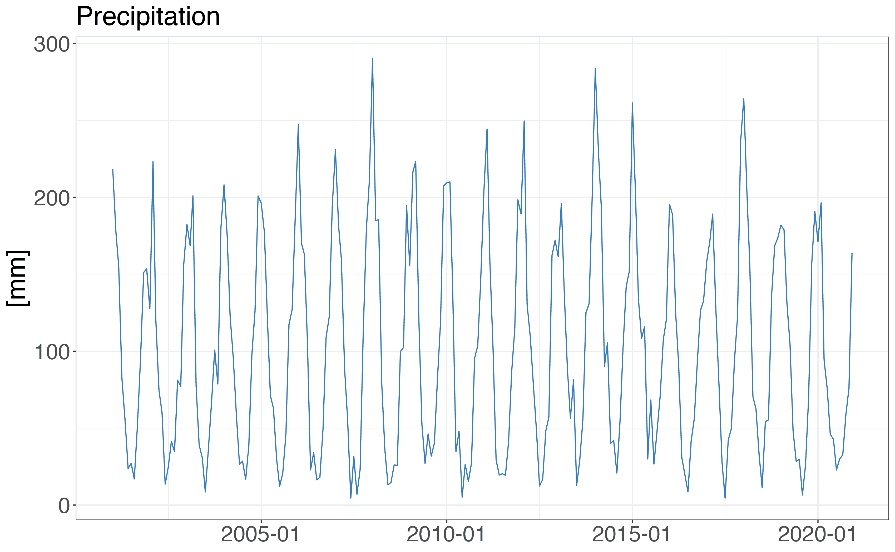
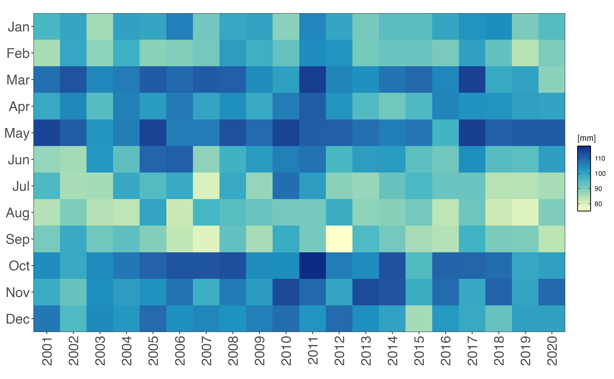
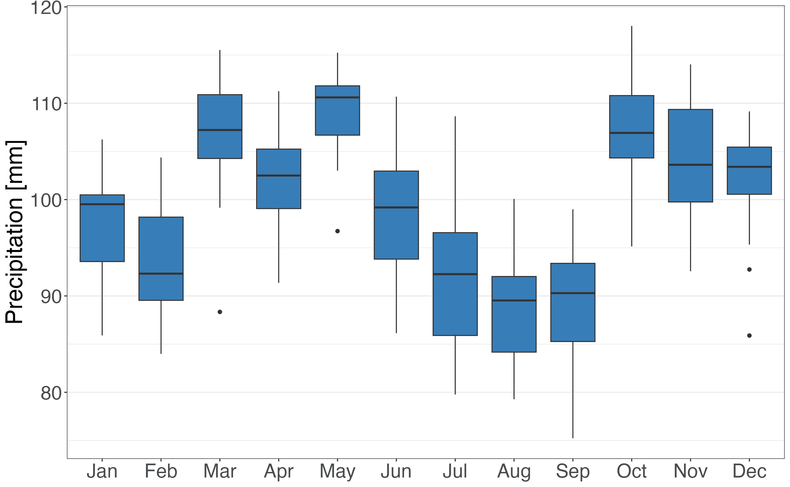
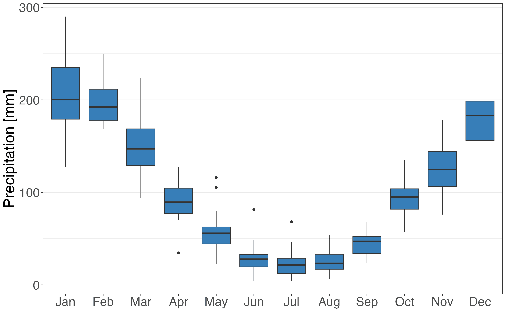
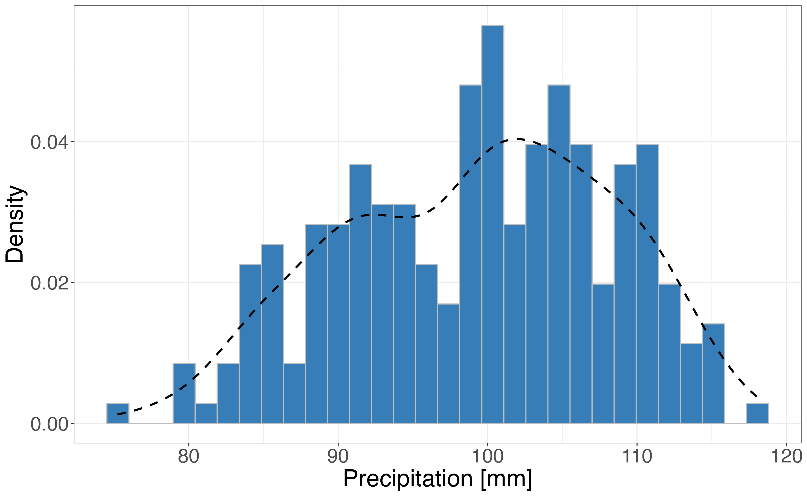

<style>
body {
text-align: justify}
</style>

***

```{r start, include = FALSE}
knitr::opts_chunk$set(
  echo = TRUE,
  eval = TRUE,
  fig.width = 7,
  warning = FALSE,
  message = FALSE
)
library(pRecipe)
library(kableExtra)
```

`pRecipe` was conceived back in 2020 as part of MRVG's doctoral dissertation at the Faculty of Environmental Sciences, Czech University of Life Sciences Prague, Czechia. Designed with reproducible science in mind, **`pRecipe` facilitates the download, exploration, visualization, and analysis** of multiple precipitation data products across various spatiotemporal scales [@vargas_godoy_precipe_2023].

<br>
~_The Global Water Cycle Budget_ | @vargas_godoy_global_2021

_"Like civilization and technology, our understanding of the global water cycle has been continuously evolving, and we have adapted our quantification methods to better exploit new technological resources. The accurate quantification of global water fluxes and storage is crucial in studying the global water cycle."_

***

# Before We Start

Like many other R packages, `pRecipe` has some system requirements:

* [PROJ](https://proj.org/download.html)
* Geospatial Data Abstraction Library [(GDAL)](https://gdal.org/en/latest/download.html)
* Network Common Data Form [(NetCDF)](https://www.unidata.ucar.edu/software/netcdf/)

# Data

`pRecipe` database hosts 27 different precipitation datasets; six gauge-based, eight satellite-based, eight reanalysis, and five hydrological model precipitation products. Their specifications as available in the database, as well as links to their providers, and their respective references are detailed in the following subsections. We have already homogenized, compacted to a single file, and stored them in [Zenodo repositories](https://zenodo.org/) under the following naming convention:

`<dataset>-<version>_<variable>_<units>_<coverage>_<start date>_<end date>_<resolution>_<time step>.nc`

The `pRecipe` data collection was homogenized to these specifications:

* `<variable>` = total precipitation (tp)
* `<units>` = millimeters (mm)
* `<resolution>` = 0.25°

E.g., Daily GPCP v3.2 [@adler_global_2018] would be:

`gpcp-v3-2_tp_mm_global_197901_202109_025_daily.nc`

## Gauge-Based Products
```{r gauge, echo=FALSE, results = 'asis'}
tibble::tribble(
  ~"Dataset", ~"Spatial Coverage", ~"Highest Temporal Resolution Available", ~"Record Length", ~"Get Data", ~"Reference",
"CPC-Global", "Land", "Daily", "1979/01-2023/09", "[Download](https://psl.noaa.gov/data/gridded/data.cpc.globalprecip.html)", "@xie_cpc_2010",
"CRU TS v4.08", "Land", "Monthly", "1901/01-2023/12", "[Download](https://crudata.uea.ac.uk/cru/data/hrg/)", "@harris_version_2020",
"EM-Earth", "Land", "Daily", "1950/01-2019/12", "[Download](https://www.frdr-dfdr.ca/repo/dataset/8d30ab02-f2bd-4d05-ae43-11f4a387e5ad)", "@tang_em-earth_2022",
"GHCN v2", "Land", "Monthly", "1900/01-2015/05", "[Download](https://psl.noaa.gov/data/gridded/data.ghcngridded.html)", "@peterson_overview_1997",
"GPCC v2022", "Land", "Daily", "1891/01-2020/10", "[Download](https://psl.noaa.gov/data/gridded/data.gpcc.html)", "@schneider_gpcc_2011",
"PREC/L", "Land", "Monthly", "1948/01-2024/10", "[Download](https://psl.noaa.gov/data/gridded/data.precl.html)", "@chen_global_2002"
) |>
  kbl(align = 'lccccr') |>
  kable_styling("striped") |>
  unclass() |> cat()
```

## Satellite-Based Products

```{r satellite, echo=FALSE, results = 'asis'}
tibble::tribble(
  ~"Dataset", ~"Spatial Coverage", ~"Highest Temporal Resolution Available", ~"Record Length", ~"Get Data", ~"Reference",
"CHIRPS v2.0", "Land 50°SN", "Daily", "1981/01-2023/08", "[Download](https://www.chc.ucsb.edu/data/chirps)", "@funk_climate_2015",
"CMAP", "Global", "Monthly", "1979/01-2024/10", "[Download](https://psl.noaa.gov/data/gridded/data.cmap.html)", "@xie_global_1997",
"CMORPH-CDR", "Global 60°SN", "Daily", "1998/01-2023/04", "[Download](https://www.ncei.noaa.gov/data/cmorph-high-resolution-global-precipitation-estimates/)", "@joyce_cmorph_2004",
"GPCP v3.2", "Global", "Daily", "1979/01-2021/09", "[Download](https://psl.noaa.gov/data/gridded/data.gpcp.html)", "@adler_global_2018",
"GPM IMERGM Final v07", "Global", "Daily", "1998/01-2024/06", "[Download](https://disc.gsfc.nasa.gov/datasets/GPM_3IMERGDF_07/summary?keywords=GPM_3IMERGDF_07)", "@huffman_gpm_2019",
"GSMaP v8", "Global", "Daily", "1998/01-2023/06", "[Download](https://sharaku.eorc.jaxa.jp/GSMaP/)", "@kubota_global_2020",
"MSWEP v2.8", "Global", "Daily", "1979/01-2024/11", "[Download](https://www.gloh2o.org/mswep/)", "@beck_mswep_2019",
"PERSIANN-CDR", "Global 60°SN", "Daily", "1983/01-2023/12", "[Download](https://chrsdata.eng.uci.edu/)", "@ashouri_persiann-cdr_2015"
) |>
  kbl(align = 'lccccr') |>
  kable_styling("striped") |>
  unclass() |> cat()
```

## Reanalysis Products

```{r reanalysis, echo=FALSE, results = 'asis'}
tibble::tribble(
  ~"Dataset", ~"Spatial Coverage", ~"Highest Temporal Resolution Available", ~"Record Length", ~"Get Data", ~"Reference",
"20CR v3", "Global", "Daily", "1836/01-2015/12", "[Download](https://psl.noaa.gov/data/gridded/data.20thC_ReanV3.html)", "@slivinski_towards_2019",
"ERA-20C", "Global", "Daily", "1900/01-2010/12", "[Download](https://www.ecmwf.int/en/forecasts/dataset/ecmwf-reanalysis-20th-century)", "@poli_era-20c_2016",
"ERA5", "Global", "Monthly", "1959/01-2021/12", "[Download](https://www.ecmwf.int/en/forecasts/dataset/ecmwf-reanalysis-v5)", "@hersbach_era5_2020",
"ERA5-Land", "Land", "Monthly", "1959/01-2021/12", "[Download](https://www.ecmwf.int/en/era5-land)", "@munoz_era5_2021",
"JRA-55", "Global", "Daily", "1958/01-2023/09", "[Download](https://rda.ucar.edu/datasets/ds628.1/dataaccess/)", "@kobayashi_jra-55_2015",
"MERRA-2", "Global", "Daily", "1980/01-2024/10", "[Download](https://disc.gsfc.nasa.gov/datasets?page=1&project=MERRA-2)", "@gelaro_modern-era_2017",
"NCEP/NCAR R1", "Global", "Daily", "1948/01-2023/12", "[Download](https://psl.noaa.gov/data/gridded/data.ncep.reanalysis.derived.html)", "@kalnay_ncepncar_1996",
"NCEP/DOE R2", "Global", "Daily", "1979/01-2023/12", "[Download](https://psl.noaa.gov/data/gridded/data.ncep.reanalysis2.html)", "@kanamitsu_ncepdoe_2002"
) |>
  kbl(align = 'lccccr') |>
  kable_styling("striped") |>
  unclass() |> cat()
```

## Hydrological Model Forcing

```{r models, echo=FALSE, results = 'asis'}
tibble::tribble(
  ~"Dataset", ~"Spatial Coverage", ~"Highest Temporal Resolution Available", ~"Record Length", ~"Get Data", ~"Reference",
"FLDAS", "Land", "Monthly", "1982/01-2024/10", "[Download](https://ldas.gsfc.nasa.gov/fldas/fldas-data-download)", "@mcnally_land_2017",
"GLDAS CLSM v2.0", "Land", "Daily", "1948/01-2014/12", "[Download](https://ldas.gsfc.nasa.gov/gldas/gldas-get-data)", "@rodell_global_2004",
"GLDAS NOAH v2.0", "Land", "Monthly", "1948/01-2014/12", "[Download](https://ldas.gsfc.nasa.gov/gldas/gldas-get-data)", "@rodell_global_2004",
"GLDAS VIC v2.0", "Land", "Monthly", "1948/01-2014/12", "[Download](https://ldas.gsfc.nasa.gov/gldas/gldas-get-data)", "@rodell_global_2004",
"TerraClimate", "Land", "Monthly", "1958/01-2023/12", "[Download](https://www.climatologylab.org/terraclimate.html)", "@abatzoglou_terraclimate_2018"
) |>
  kbl(align = 'lccccr') |>
  kable_styling("striped") |>
  unclass() |> cat()
```

# Introduction to *pRecipe*

In this introductory demo we will first download the GPM-IMERGM dataset. We will then subset the downloaded data over South America for the 2001-2015 period, and crop it to the national scale for Bolivia. In the next step, we will generate time series for our datasets and conclude with the visualization of our data.

**NOTE:** While the functions in `pRecipe` are intended to work directly with its data inventory. `pRecipe` can handle most other datasets in ".nc" format, as well as any other ".nc" file generated by its functions.

## Installation

```{r install, eval = FALSE}
install.packages('pRecipe')
library(pRecipe)
```

## Data Download

Downloading the entire data collection or only a few datasets is quite straightforward. You just call the `download_data` function, which has four arguments *dataset*, *path*, *domain*, and *timestep*.

* *dataset* is set to "all" by default, but you can specify the names of your datasets of interest only.
* *path* is set to "." by default. I.e., the current working directory. By replacing it for [your_project_folder], the downloaded files will be stored in [your_project_folder] instead.
* *domain* is set to "raw" by default, but you can specify the domain of your interest only. E.g., "ocean" for ocean only datasets (For availability please check the [Data] section). 
* *timestep* is set to "monthly" by default, but if you prefer you can also download annual data with "yearly".

Let's download the GPM-IMERGM dataset and inspect its content with `infoNC`:

```{r download, eval = FALSE}
download_data(dataset = 'gpm-imerg')
gpm_global <- raster::brick('gpm-imerg-v7_tp_mm_global_199801_202406_025_monthly.nc')
infoNC(gpm_global)
```

```
[1] "class      : RasterBrick "
[2] "dimensions : 720, 1440, 1036800, 318  (nrow, ncol, ncell, nlayers)"
[3] "resolution : 0.25, 0.25  (x, y)"
[4] "extent     : -180, 180, -90, 90  (xmin, xmax, ymin, ymax)"
[5] "crs        : +proj=longlat +datum=WGS84 +no_defs "
[6] "source     : gpm-imerg_tp_mm_global_200006_202012_025_monthly.nc "
[7] "names      : X1998.01.01, X1998.02.01, X1998.03.01, X1998.04.01, X1998.05.01, X1998.06.01, X1998.07.01, X1998.08.01, X1998.09.01, X1998.10.01, X1998.11.01, X1998.12.01, X1999.01.01, X1999.02.01, X1999.03.01, ... "
[8] "Date/time  : 1998-01-01, 2024-06-01 (min, max)"
[9] "varname    : tp " 
```

## Processing

Once we have downloaded our database, we can start processing the data with:

* `crop_data` to crop the data using a shapefile.
* `fldmean` to generate a time series by taking the area weighted average over each timestep.
* `remap` to go from the native resolution (0.25°) to coarser ones (e.g., 0.5°, 1°, 1.5°, ...).
* `subset_data` to subset the data in time and/or space.
* `yearstat` to aggregate the data from monthly into annual.

### Subset

To subset our data to a desired region and period of interest, we use the `subset_data` function, which has three arguments *x*, *box*, and *yrs*.

* *x* Raster* object or a data.table or a filename (character).
* *box* is the bounding box of the region of interest with the coordinates in degrees in the form (xmin, xmax, ymin, ymax).
* *yrs* is the period of interest with years in the form (start_year, end_year).

Let's subset the GPM-IMERGM dataset over South America (-96, -30, -56, 24) for the 2001-2020 period, and inspect its content with `infoNC`:

```{r subset, eval = FALSE}
gpm_subset <- subset_data(gpm_global, box = c(-96, -30, -56, 24), yrs = c(2001, 2020))
infoNC(gpm_subset)
```

```
[1] "class      : RasterBrick "
[2] "dimensions : 320, 264, 84480, 240  (nrow, ncol, ncell, nlayers)"
[3] "resolution : 0.25, 0.25  (x, y)"
[4] "extent     : -96, -30, -56, 24  (xmin, xmax, ymin, ymax)"
[5] "crs        : +proj=longlat +datum=WGS84 +no_defs "
[6] "source     : r_tmp_2024-12-05_204859.40679_5927_83505.grd "
[7] "names      :  X2001.01.01,  X2001.02.01,  X2001.03.01,  X2001.04.01,  X2001.05.01,  X2001.06.01,  X2001.07.01,  X2001.08.01,  X2001.09.01,  X2001.10.01,  X2001.11.01,  X2001.12.01,  X2002.01.01,  X2002.02.01,  X2002.03.01, ... "
[8] "min values :           0,           0,           0,           0,           0,           0,           0,           0,           0,           0,           0,           0,           0,           0,           0, ... "
[9] "max values :    877.0017,    830.7960,    926.5452,    879.0210,   1614.3760,   1347.4813,   1298.2778,   1030.6008,   2121.5745,   1154.9041,   1012.2653,    937.1544,    983.7074,    828.4057,    712.0858, ... "
[10] "time       : 2001-01-01, 2020-12-01 (min, max)"  
```

### Crop

To further crop our data to a desired polygon other than a rectangle, we use the `crop_data` function, which has two arguments *x*, and *y*.

* *x* Raster* object or a data.table or a *.nc filename (character).
* *y* is a ".shp" filename (character).

Let's crop our GPM-IMERG subset to cover only Bolivia with the respective [shape file](https://geodata.ucdavis.edu/gadm/gadm4.1/shp/gadm41_BOL_shp.zip), and inspect its content with `infoNC`:

```{r crop, eval = FALSE}
gpm_bol <- crop_data(gpm_subset, "gadm41_BOL_0.shp")
infoNC(gpm_bol)
```

```
[1] "class      : RasterBrick "
[2] "dimensions : 54, 50, 2700, 180  (nrow, ncol, ncell, nlayers)"
[3] "resolution : 0.25, 0.25  (x, y)"
[4] "extent     : -69.75, -57.25, -23, -9.5  (xmin, xmax, ymin, ymax)"
[5] "crs        : +proj=longlat +datum=WGS84 +no_defs "
[6] "source     : memory"
[7] "names      :  X2001.01.01,  X2001.02.01,  X2001.03.01,  X2001.04.01,  X2001.05.01,  X2001.06.01,  X2001.07.01,  X2001.08.01,  X2001.09.01,  X2001.10.01,  X2001.11.01,  X2001.12.01,  X2002.01.01,  X2002.02.01,  X2002.03.01, ... "
[8] "min values : 2.402562e+01, 4.327217e+01, 8.482053e+00, 9.562346e-01, 3.222862e-02, 0.000000e+00, 0.000000e+00, 5.553878e-03, 1.055679e-02, 4.221552e-02, 2.083128e-01, 8.674479e+00, 2.208736e+00, 1.188102e+01, 6.304548e+00, ... "
[9] "max values :    512.37097,    585.90833,    509.95139,    418.54199,    243.92047,    124.44180,    201.84206,    109.64172,    167.08734,    303.71823,    439.69751,    497.84958,    485.17444,    565.73810,    572.18994, ... "
[10] "time       : 2001-01-01, 2020-12-01 (min, max)" 
```

### Generate Time series

To make a time series out of our data, we use the `fldmean` function, which has one argument *x*.

* *x* Raster* object or a data.table or a *.nc filename (character).

Let's generate the time series for our three different GPM-IMERGM datasets (Global, South America, and Bolivia), and inspect its first 12 rows:

```{r global_ts, eval = FALSE}
gpm_global_ts <- fldmean(gpm_global)
head(gpm_global_ts, 12)
```

```
          date    value
        <Date>    <num>
 1: 1998-01-01 82.64305
 2: 1998-02-01 78.81371
 3: 1998-03-01 87.46418
 4: 1998-04-01 86.26875
 5: 1998-05-01 89.34600
 6: 1998-06-01 83.88119
 7: 1998-07-01 87.55151
 8: 1998-08-01 87.38290
 9: 1998-09-01 82.47541
10: 1998-10-01 82.77823
11: 1998-11-01 80.51179
12: 1998-12-01 85.23061
```

```{r subset_ts, eval = FALSE}
gpm_subset_ts <- fldmean(gpm_subset)
head(gpm_subset_ts, 12)
```

```
          date     value
        <Date>     <num>
 1: 2001-01-01  95.95988
 2: 2001-02-01  85.44723
 3: 2001-03-01 108.46433
 4: 2001-04-01  99.11680
 5: 2001-05-01 114.35870
 6: 2001-06-01  87.50668
 7: 2001-07-01  95.68529
 8: 2001-08-01  84.40069
 9: 2001-09-01  90.51047
10: 2001-10-01 104.37209
11: 2001-11-01  98.31326
12: 2001-12-01 107.36328
```

```{r bol_ts, eval = FALSE}
gpm_bol_ts <- fldmean(gpm_bol)
head(gpm_bol_ts, 12)
```

```
          date     value
        <Date>     <num>
 1: 2001-01-01 218.27810
 2: 2001-02-01 177.55739
 3: 2001-03-01 154.74973
 4: 2001-04-01  82.46497
 5: 2001-05-01  56.24647
 6: 2001-06-01  23.71866
 7: 2001-07-01  27.05753
 8: 2001-08-01  17.00265
 9: 2001-09-01  51.99784
10: 2001-10-01  94.54848
11: 2001-11-01 151.14781
12: 2001-12-01 153.45496
```

## Visualize

Either after we have processed our data as required or right after downloaded, we have different options to visualize our data:

* `plot_box` to see a seasonal boxplot.
* `plot_density` to see the empirical density of monthly precipitation.
* `plot_heatmap` to see a heatmap of all monthly values.
* `plot_line` to see the average time series.
* `plot_map` to see the Cartesian lon-lat map of the first raster layer.
* `plot_summary` to see line, heatmap, box, and density plot together in a single plot.
* `plot_taylor` to see a Taylor Diagram (requires a referential dataset).

Let's plot our three different GPM-IMERGM datasets (Global, South America, and Bolivia)

### Maps

To see a map of any dataset raw or processed, we use `plot_map`.

```{r map_global, eval = FALSE}
plot_map(gpm_global)
```

{width=90%}

```{r map_subset, eval = FALSE}
plot_map(gpm_subset)
```

{width=62%}

```{r map_bo, eval = FALSE}
plot_map(gpm_bol)
```

{width=62%}

### Time Series Visuals

#### Line

```{r lines, eval = FALSE}
plot_line(gpm_global_ts)
```

{width=90%}
```{r lines_sa, eval = FALSE}
plot_line(gpm_subset_ts)
```

{width=90%}

```{r lines_bo, eval = FALSE}
plot_line(gpm_bol_ts)
```

{width=90%}

#### Heatmap

```{r hearmaps, eval = FALSE}
plot_heatmap(gpm_global_ts)
```

{width=90%}
```{r hearmaps_sa, eval = FALSE}
plot_heatmap(gpm_subset_ts)
```

{width=90%}
```{r hearmaps_bo, eval = FALSE}
plot_heatmap(gpm_bol_ts)
```
{width=90%}

#### Boxplot

```{r boxplots, eval = FALSE}
plot_box(gpm_global_ts)
```

{width=90%}

```{r boxplots_sa, eval = FALSE}
plot_box(gpm_subset_ts)
```

{width=90%}

```{r boxplots_bo, eval = FALSE}
plot_box(gpm_bol_ts)
```
{width=90%}

#### Density

```{r histograms, eval = FALSE}
plot_density(gpm_global_ts)
```
{width=90%}
```{r histograms_sa, eval = FALSE}
plot_density(gpm_subset_ts)
```
{width=90%}
```{r histograms_bo, eval = FALSE}
plot_density(gpm_bol_ts)
```
{width=90%}

#### Summary

```{r summary, eval=FALSE}
plot_summary(gpm_global_ts)
#plot_summary(gpm_subset_ts)
#plot_summary(gpm_cz_ts)
```

{width=90%}

# Coming Soon

More functions for data processing and analysis.

# Citation

If you acquire precipitation data products from `pRecipe`, we ask that you acknowledge us in your use of the data. We would also appreciate receiving a copy of the relevant publications. This will help pRecipe to justify keeping the data freely available online in the future. Thank you!

# References
