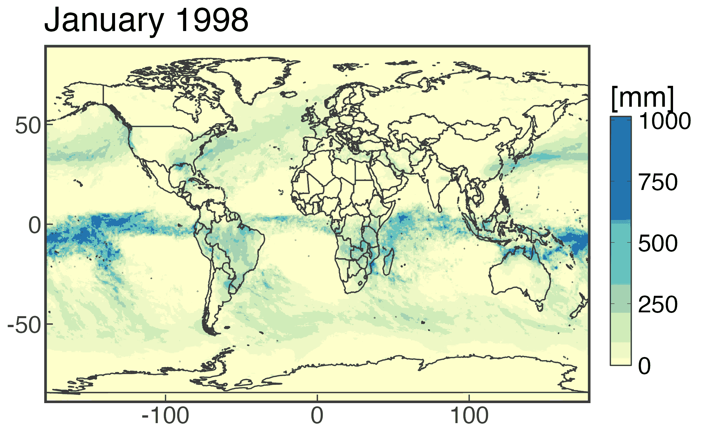
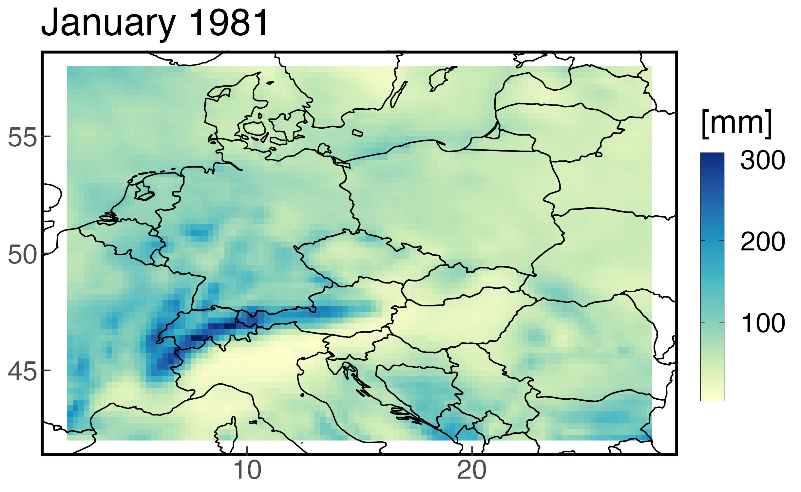
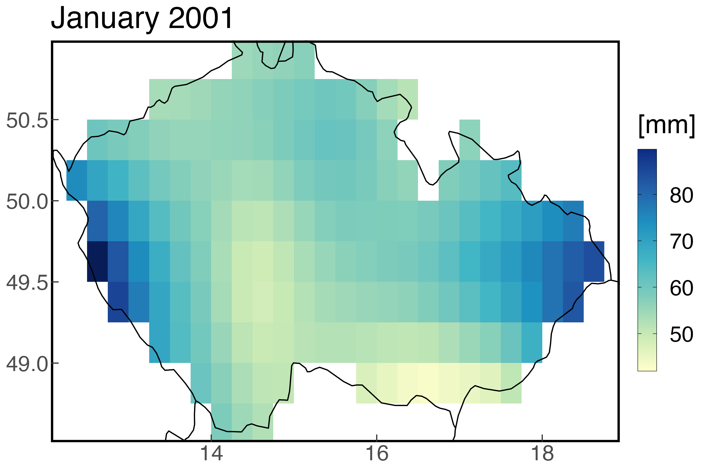
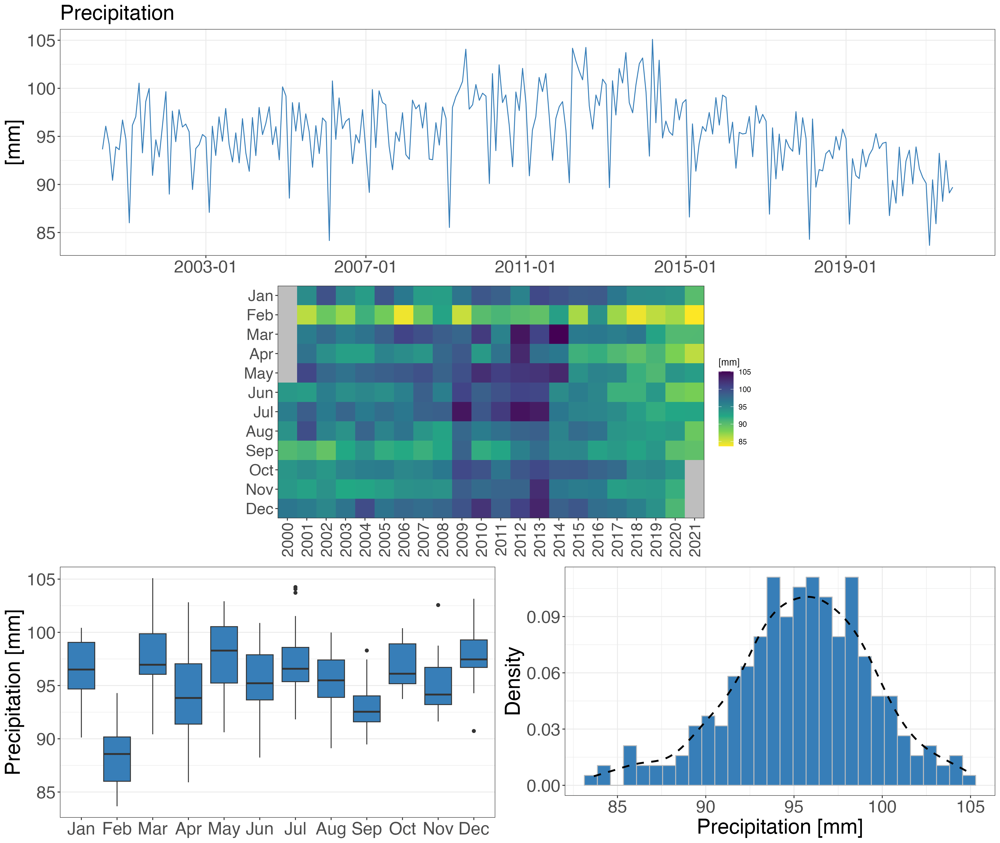

<style>
body {
text-align: justify}
</style>

***

```{r, include = FALSE}
knitr::opts_chunk$set(
  echo = TRUE,
  eval = TRUE,
  fig.width = 7,
  warning = FALSE,
  message = FALSE
)
library(pRecipe)
data("era5_global_ts")
data("era5_ce_ts")
data("era5_cze_ts")
```

`pRecipe` was conceived back in 2019 as part of MRVG's doctoral dissertation at the Faculty of Environmental Sciences, Czech University of Life Sciences Prague, Czech Republic. Designed with reproducible science in mind, **`pRecipe` facilitates the download, exploration, visualization, and analysis** of multiple precipitation data products across various spatiotemporal scales.

<br>
~_The Global Water Cycle Budget_ | @vargas_godoy_global_2021

_"Like civilization and technology, our understanding of the global water cycle has been continuously evolving, and we have adapted our quantification methods to better exploit new technological resources. The accurate quantification of global water fluxes and storage is crucial in studying the global water cycle."_

***

## Before We Start

Like many other R packages, `pRecipe` has some system requirements:

* [PROJ](https://proj.org/download.html)
* Geospatial Data Abstraction Library [(GDAL)](https://gdal.org/download.html)
* Network Common Data Form [(NetCDF)](https://www.unidata.ucar.edu/software/netcdf/)

## Data

`pRecipe` database hosts 24 different precipitation data sets; seven gauge-based, eight satellite-based, five reanalysis, and four hydrological model precipitation products. Their native specifications, as well as links to their providers, and their respective references are detailed in the following subsections. We have already homogenized, compacted to a single file, and stored them in a [Zenodo repository](https://zenodo.org/record/7094293) under the following naming convention:

`<data set>_<variable>_<units>_<coverage>_<start date>_<end date>_<resolution>_<time step>.nc`

The `pRecipe` data collection was homogenized to these specifications:

* `<variable>` = total precipitation (tp)
* `<units>` = millimeters (mm)
* `<resolution>` = 0.25$^\circ$
* `<time step>` = monthly

E.g., GPCP v2.3 [@adler_global_2018] would be:

`gpcp_tp_mm_global_197901_202205_025_monthly.nc`

### Gauge-Based Products

Data Set | Spatial Resolution | Spatial Coverage | Temporal Resolution | Record Length | Get Data | Reference
--------------|:-:|:-:|:-:|:------------:|:-:|---------------:
CPC-Global | 0.5$^\circ$ | Land | Daily | 1979/01-2022/08 | [Download](https://psl.noaa.gov/data/gridded/data.cpc.globalprecip.html) | @xie_cpc_2010
CRU TS v4.06 | 0.5$^\circ$ | Land | Monthly | 1901/01-2021/12 | [Download](https://crudata.uea.ac.uk/cru/data/hrg/) | @harris_version_2020
EM-EARTH | 0.1$^\circ$ | Land | Daily | 1950/01-2019/12 | [Download](https://www.frdr-dfdr.ca/repo/dataset/8d30ab02-f2bd-4d05-ae43-11f4a387e5ad) | @tang_em-earth_2022
GHCN v2 | 5$^\circ$ | Land | Monthly | 1900/01-2015/05 | [Download](https://psl.noaa.gov/data/gridded/data.ghcngridded.html) | @peterson_overview_1997
GPCC v2020 | 0.25$^\circ$ | Land | Monthly | 1891/01-2022/08 | [Download](https://psl.noaa.gov/data/gridded/data.gpcc.html) | @schneider_gpcc_2011
PREC/L | 0.5$^\circ$ | Land | Monthly | 1948/01-2022/08 | [Download](https://psl.noaa.gov/data/gridded/data.precl.html) | @chen_global_2002
UDel v5.01 | 0.5$^\circ$ | Land | Monthly | 1901/01-2017/12 | [Download](https://psl.noaa.gov/data/gridded/data.UDel_AirT_Precip.html) | @willmott_terrestrial_2001

### Satellite-Based Products

Data Set | Spatial Resolution | Spatial Coverage | Temporal Resolution | Record Length | Get Data | Reference
--------------|:-:|:-:|:-:|:------------:|:-:|---------------:
CHIRPS v2.0 | 0.05$^\circ$ | 50$^\circ$S-N Land | Monthly | 1981/01-2022/07 | [Download](https://www.chc.ucsb.edu/data/chirps) | @funk_climate_2015
CMAP | 2.5$^\circ$ | Global | Monthly | 1979/01-2022/07 | [Download](https://psl.noaa.gov/data/gridded/data.cmap.html) | @xie_global_1997
CMORPH | 0.25$^\circ$ | 60$^\circ$S-N Global | Daily | 1998/01-2021/12 | [Download](https://www.ncei.noaa.gov/data/cmorph-high-resolution-global-precipitation-estimates/) | @joyce_cmorph_2004
GPCP v2.3 | 0.5$^\circ$ | Global | Monthly | 1979/01-2022/05 | [Download](https://psl.noaa.gov/data/gridded/data.gpcp.html) | @adler_global_2018
GPM IMERGM v06 | 0.1$^\circ$ | Global | Monthly | 2000/06-2020/12 | [Download](https://doi.org/10.5067/GPM/IMERG/3B-MONTH/06) | @huffman_gpm_2019
MSWEP v2.8 | 0.1$^\circ$ | Global | Monthly | 1979/02-2022/06 | [Download](http://www.gloh2o.org/mswep/) | @beck_mswep_2019
PERSIANN-CDR | 0.25$^\circ$ | 60$^\circ$S-N Global | Monthly | 1983/01-2022/06 | [Download](https://chrsdata.eng.uci.edu/) | @ashouri_persiann-cdr_2015
TRMM 3B43 v7 | 0.25$^\circ$ | 50$^\circ$S-N Global | Monthly | 1998/01-2019/12 | [Download](https://doi.org/10.5067/TRMM/TMPA/MONTH/7) | @huffman_trmm_2010

### Reanalysis Products

Data Set | Spatial Resolution | Spatial Coverage | Temporal Resolution | Record Length | Get Data | Reference
--------------|:-:|:-:|:-:|:------------:|:-:|---------------:
20CR v3 | 1$^\circ$ | Global | Monthly | 1836/01-2015/12 | [Download](https://psl.noaa.gov/data/gridded/data.20thC_ReanV3.html) | @slivinski_towards_2019
ERA-20C | 1.125$^\circ$ | Global | Monthly | 1900/01-2010/12 | [Download](https://www.ecmwf.int/en/forecasts/datasets/reanalysis-datasets/era-20c) | @poli_era-20c_2016
ERA5 | 0.25$^\circ$ | Global | Monthly | 1959/01-2021/12 | [Download](https://www.ecmwf.int/en/forecasts/datasets/reanalysis-datasets/era5) | @hersbach_era5_2020
JRA-55 | 1.25$^\circ$ | Global | Monthly | 1958/01-2021/12 | [Download](https://rda.ucar.edu/datasets/ds628.1/dataaccess/) | @kobayashi_jra-55_2015
MERRA-2 | 0.5$^\circ$ x 0.625$^\circ$ | Global | Monthly | 1980/01-2023/01 | [Download](https://disc.gsfc.nasa.gov/datasets?page=1&project=MERRA-2) | @gelaro_modern-era_2017
NCEP/NCAR R1 | 1.875$^\circ$ | Global | Monthly | 1948/01-2022/08 | [Download](https://psl.noaa.gov/data/gridded/data.ncep.reanalysis.derived.html) | @kalnay_ncepncar_1996
NCEP/DOE R2 | 1.875$^\circ$ | Global | Monthly | 1979/01-2022/08 | [Download](https://psl.noaa.gov/data/gridded/data.ncep.reanalysis2.html) | @kanamitsu_ncepdoe_2002

### Hydrological Model Forcing

Data Set | Spatial Resolution | Spatial Coverage | Temporal Resolution | Record Length | Get Data | Reference
--------------|:-:|:-:|:-:|:------------:|:-:|---------------:
FLDAS | 0.1$^\circ$ | Land | Monthly | 1982/01-2021/12 | [Download](https://ldas.gsfc.nasa.gov/fldas/fldas-data-download) | @mcnally_land_2017
GLDAS CLSM v2.0 | 0.25$^\circ$ | Land | Daily | 1948/01-2014/12 | [Download](https://ldas.gsfc.nasa.gov/gldas/gldas-get-data) | @rodell_global_2004
GLDAS NOAH v2.0 | 0.25$^\circ$ | Land | Monthly | 1948/01-2014/12 | [Download](https://ldas.gsfc.nasa.gov/gldas/gldas-get-data) | @rodell_global_2004
GLDAS VIC v2.0 | 1$^\circ$ | Land | Monthly | 1948/01-2014/12 | [Download](https://ldas.gsfc.nasa.gov/gldas/gldas-get-data) | @rodell_global_2004
TerraClimate | 4$km$ | Land | Monthly | 1958/01-2021/12 | [Download](https://www.climatologylab.org/terraclimate.html) | @abatzoglou_terraclimate_2018

# Recipe

In this introductory recipe we will first download the ERA5 data set. We will then subset the downloaded data over Central Europe for the 1981-2020 period, and crop it to the national scale for Czech Republic. In the next step, we will generate time series for our data sets and conclude with the visualization of our data.

**NOTE:** While the functions in `pRecipe` are intended to work directly with its data inventory. It can handle most other precipitation data sets in ".nc" format, as well as any other ".nc" file generated by its functions.

## Installation

```{r, eval=FALSE}
install.packages('pRecipe')
library(pRecipe)
```

## Download

Downloading the entire data collection or only a few data sets is quite straightforward. You just call the `download_data` function, which has two arguments *data_name* and *destination*.

* *data_name* is set to "all" by default, but you can specify the names of your data sets of interest only.
* *destination* is set to "." by default. I.e., the current working directory. By replacing it for [your_project_folder], the downloaded files will be stored in [your_project_folder] instead.

Let's download the ERA5 data set and inspect its content with `show_info`:

```{r, eval=FALSE}
download_data(data_name = "era5", destination = ".")
show_info("era5_tp_mm_global_195901_202112_025_monthly.nc")
```

```
[1] "class      : RasterBrick "                                         
[2] "dimensions : 720, 1440, 1036800, 756  (nrow, ncol, ncell, nlayers)"
[3] "resolution : 0.25, 0.25  (x, y)"
[4] "extent     : -180, 180, -90, 90  (xmin, xmax, ymin, ymax)"
[5] "crs        : +proj=longlat +datum=WGS84 +no_defs "
[6] "source     : era5_tp_mm_global_195901_202112_025_monthly.nc "
[7] "names      : X1959.01.01, X1959.02.01, X1959.03.01, X1959.04.01, X1959.05.01, X1959.06.01, X1959.07.01, X1959.08.01, X1959.09.01, X1959.10.01, X1959.11.01, X1959.12.01, X1960.01.01, X1960.02.01, X1960.03.01, ... "
[8] "Date/time  : 1959-01-01, 2021-12-01 (min, max)"
[9] "varname    : tp " 
```

## Processing

Once we have downloaded our database, we can start processing the data with:

* `subset_spacetime` to subset the data in time and space.
* `subset_space` to subset the data to the region of interest.
* `subset_time` to select the years of interest.
* `mon_to_year` to aggregate the data from monthly into annual.
* `rescale_data` to go from the native resolution (0.25$^\circ$) to coarser ones (e.g., 0.5$^\circ$, 1$^\circ$, 1.5$^\circ$, 2$^\circ$, etc).
* `make_ts` to generate a time series by taking the area weighted average over each time step.

### Subset

To subset our data to a desired region and period of interest, we use the `subset_spacetime` function, which has four arguments *data_file*, *years*, *bbox*, and *autosave*.

* *data_file* is the path to the data set of interest. The output file will be stored in the same location of the input file.
* *years* is the period of interest in the form (start_year, end_year)
* *bbox* is the bounding box of the region of interest with the coordinates in degrees in the form (xmin, xmax, ymin, ymax).
* *autosave* logical FALSE (default). If TRUE data will be automatically stored in the same location of the input file.

Let's subset the ERA5 data set over Central Europe (2,28,42,58) for the 1981-2020 period, and inspect its content with `show_info`:

```{r, eval=FALSE}
subset_spacetime("era5_tp_mm_global_195901_202112_025_monthly.nc", 
                 years = c(1981, 2020), bbox = c(2,28,42,58), autosave = TRUE)
show_info("era5_tp_mm_subset_198101_202012_025_monthly.nc")
```

```
[1] "class      : RasterBrick "
[2] "dimensions : 64, 104, 6656, 480  (nrow, ncol, ncell, nlayers)"
[3] "resolution : 0.25, 0.25  (x, y)"
[4] "extent     : 2, 28, 42, 58  (xmin, xmax, ymin, ymax)"
[5] "crs        : +proj=longlat +datum=WGS84 +no_defs "
[6] "source     : era5_tp_mm_subset_198101_202012_025_monthly.nc "
[7] "names      : X1981.01.01, X1981.02.01, X1981.03.01, X1981.04.01, X1981.05.01, X1981.06.01, X1981.07.01, X1981.08.01, X1981.09.01, X1981.10.01, X1981.11.01, X1981.12.01, X1982.01.01, X1982.02.01, X1982.03.01, ... "
[8] "Date/time  : 1981-01-01, 2020-12-01 (min, max)"
[9] "varname    : tp "
```

### Crop

To further crop our data to a desired polygon other than a rectangle, we use the `crop_data` function, which has three arguments *data_file*, *shp_path*, *autosave*.

* *data_file* is the path to a ".nc" data set file.
* *shp_path* is the path to a ".shp" file that we want to use to crop our data.
* *autosave* logical FALSE (default). If TRUE data will be automatically stored in the same location of the input file.


Let's crop our ERA5 subset to cover only the Czech Republic with the respective [shape file](https://geodata.ucdavis.edu/gadm/gadm4.1/shp/gadm41_CZE_shp.zip), and inspect its content with `show_info`:

```{r, eval=FALSE}
crop_data(data_file = "era5_tp_mm_subset_198101_202012_025_monthly.nc", 
          shp_path = "CZE_adm0.shp", autosave = TRUE)
show_info("era5_tp_mm_cropped_198101_202012_025_monthly.nc")
```

```
[1] "class      : RasterBrick "
[2] "dimensions : 64, 104, 6656, 480  (nrow, ncol, ncell, nlayers)"
[3] "resolution : 0.25, 0.25  (x, y)"
[4] "extent     : 2, 28, 42, 58  (xmin, xmax, ymin, ymax)"
[5] "crs        : +proj=longlat +datum=WGS84 +no_defs "
[6] "source     : era5_tp_mm_subset_1981_2020_025_monthly_cropped.nc "
[7] "names      : X1981.01.01, X1981.02.01, X1981.03.01, X1981.04.01, X1981.05.01, X1981.06.01, X1981.07.01, X1981.08.01, X1981.09.01, X1981.10.01, X1981.11.01, X1981.12.01, X1982.01.01, X1982.02.01, X1982.03.01, ... "
[8] "Date/time  : 1981-01-01, 2020-12-01 (min, max)"
[9] "varname    : tp " 
```

### Generate Time series

To make a time series out of our data, we use the `make_ts` function, which has two argument *data_file* and *autosave*.

* *data_file* is the path to a ".nc" data set file.
* *autosave* logical FALSE (default). If TRUE data will be automatically stored in the same location of the input file.

Let's generate the time series for our three different ERA5 data sets (Global, Central Europe, and Czech Republic), and inspect its first 12 rows:

```{r, eval=FALSE}
era5_global_ts <- make_ts("era5_tp_mm_global_195901_202112_025_monthly.nc")
head(era5_global_ts, 12)
```

```
          date    value
        <IDat>    <num>
 1: 1959-01-01 90.64116
 2: 1959-02-01 78.91318
 3: 1959-03-01 87.50946
 4: 1959-04-01 86.93461
 5: 1959-05-01 87.25465
 6: 1959-06-01 89.14776
 7: 1959-07-01 91.84578
 8: 1959-08-01 90.96841
 9: 1959-09-01 85.30629
10: 1959-10-01 88.53759
11: 1959-11-01 85.49954
12: 1959-12-01 90.00676
```

```{r, eval=FALSE}
era5_ce_ts <- make_ts("era5_tp_mm_subset_198101_202012_025_monthly.nc")
head(era5_ce_ts, 12)
```

```
          date     value
        <IDat>     <num>
 1: 1981-01-01  73.83279
 2: 1981-02-01  46.39281
 3: 1981-03-01  89.47381
 4: 1981-04-01  47.78148
 5: 1981-05-01  88.37288
 6: 1981-06-01  98.71906
 7: 1981-07-01 100.87810
 8: 1981-08-01  69.74586
 9: 1981-09-01  89.17575
10: 1981-10-01 111.56850
11: 1981-11-01  74.93134
12: 1981-12-01 112.66740 
```

```{r, eval=FALSE}
era5_cze_ts <-make_ts("era5_tp_mm_cropped_198101_202012_025_monthly.nc")
head(era5_cze_ts, 12)
```

```
          date     value
        <IDat>     <num>
 1: 1981-01-01  65.02662
 2: 1981-02-01  38.92457
 3: 1981-03-01  68.44784
 4: 1981-04-01  49.73646
 5: 1981-05-01  77.29006
 6: 1981-06-01  67.25784
 7: 1981-07-01 188.89990
 8: 1981-08-01  80.37363
 9: 1981-09-01  90.08721
10: 1981-10-01 115.19530
11: 1981-11-01  75.15187
12: 1981-12-01  89.48265
```

## Visualize

Either after we have processed our data as required or right after downloaded, we have six different options to visualize our data:

* `plot_taylor` to see a Taylor Diagram (requires a referential data set).
* `plot_map` to see the Cartesian lon-lat map of the first raster layer.
* `plot_line` to see the average time series.
* `plot_heatmap` to see a heatmap of all monthly values.
* `plot_box` to see a seasonal boxplot.
* `plot_density` to see the empirical density of monthly precipitation.
* `plot_summary` to see line, heatmap, box, and density plot together in a single plot.

Let's plot our three different ERA5 data sets (Global, Central Europe, and Czech Republic)

### Maps

To see a map of any data set raw or processed, we use `plot_map` which takes only one layer of the RasterBrick as input.

```{r, eval=FALSE}
global <- raster::brick("era5_tp_mm_global_195901_202112_025_monthly.nc")
plot_map(global[[1]])
```

{width=90%}

```{r, eval=FALSE}
central_europe <- raster::brick("era5_tp_mm_subset_198101_202012_025_monthly.nc")
plot_map(central_europe[[1]])
```

{width=90%}

```{r, eval=FALSE}
czechia <- raster::brick("era5_tp_mm_cropped_198101_202012_025_monthly.nc")
plot_map(czechia[[1]])
```

{width=90%}

### Time Series Visuals

To draw a time series generated by `make_ts`, we use any of the options below, which takes only a `make_ts` ".csv" generated file.

#### Line

```{r}
plot_line(era5_global_ts)
plot_line(era5_ce_ts)
plot_line(era5_cze_ts)
```

#### Heatmap

```{r}
plot_heatmap(era5_global_ts)
plot_heatmap(era5_ce_ts)
plot_heatmap(era5_cze_ts)
```

#### Boxplot

```{r}
plot_box(era5_global_ts)
plot_box(era5_ce_ts)
plot_box(era5_cze_ts)
```

#### Density

```{r}
plot_density(era5_global_ts)
plot_density(era5_ce_ts)
plot_density(era5_cze_ts)
```

#### Summary

**NOTE:** For good aesthetics we recommend saving `plot_summary` with `ggsave(<filename>, <plot>, width = 16.3, height = 15.03)`.

```{r, eval=FALSE}
plot_summary(era5_global_ts)
#plot_summary(era5_ce_ts)
#plot_summary(era5_cze_ts)
```

{width=95%}

# Coming Soon

More functions for data processing and expanding the database.

# References
