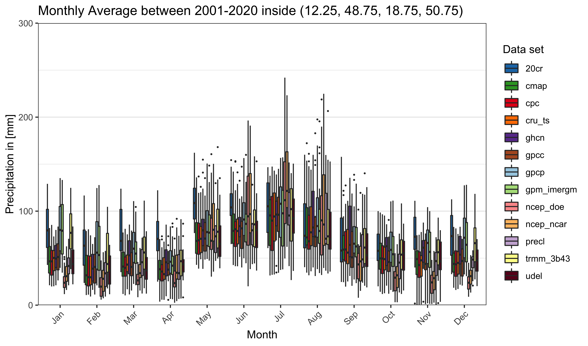

```{r, include = FALSE}
knitr::opts_chunk$set(
  echo = TRUE,
  eval = FALSE
)
```

This is is an introductory presentation of the `pRecipe` package, as implemented in the study of [Vargas Godoy et al. [2022]](link), to assess global water cycle intensification in Czechia.

## Create database

In this study multiple precipitation data sets publicly available were used. Namely: [20CR v3](https://psl.noaa.gov/data/gridded/data.20thC_ReanV3.html), [CMAP](https://psl.noaa.gov/data/gridded/data.cmap.html), [CPC](https://psl.noaa.gov/data/gridded/data.cpc.globalprecip.html), [CRU TS v4.05](https://crudata.uea.ac.uk/cru/data/hrg/), [GHCN v2](https://psl.noaa.gov/data/gridded/data.ghcngridded.html), [GPCC v2018](https://psl.noaa.gov/data/gridded/data.gpcc.html), [GPCP v2.3](https://psl.noaa.gov/data/gridded/data.gpcp.html), [GPM IMERGM v06](https://doi.org/10.5067/GPM/IMERG/3B-MONTH/06), [NCEP/NCAR R1](https://psl.noaa.gov/data/gridded/data.ncep.reanalysis.derived.html), [NCEP/DOE R2](https://psl.noaa.gov/data/gridded/data.ncep.reanalysis2.html), [PREC/L](https://psl.noaa.gov/data/gridded/data.precl.html), [TRMM 3B43 v7](https://doi.org/10.5067/TRMM/TMPA/MONTH/7), and [UDel v5.01](https://doi.org/10.5067/TRMM/TMPA/MONTH/7). They were all homogenized into monthly 0.5x0.5 `data.table` stored as a `.Rds` file per year per data set under ./data/database.


```{r}
library(pRecipe)
download_data() #(default) download and reformat all the data sets listed above.
```

## Import data

To import all data or a subset of interest is straightforward:

```{r}
precip <- import_subset_data(name = "all", start_year = 1836, end_year = 2020, 
                             bbox = c(12.25, 48.75, 18.75, 50.75))
```


## Crop data

To crop the data the used a shapefile for [Czechia](https://www.eea.europa.eu/data-and-maps/data/eea-reference-grids-2/gis-files/czech-republic-shapefile)

```{r}
precip <- crop_data(precip, "cz_1km.shp")
```

## Exploratory Data Analysis

Now we can start exploring the data through different plot options, e.g.:

```{r}
plot_box(precip[year(Z)>2000 & year(Z)<=2020])
```

{width=90%}


