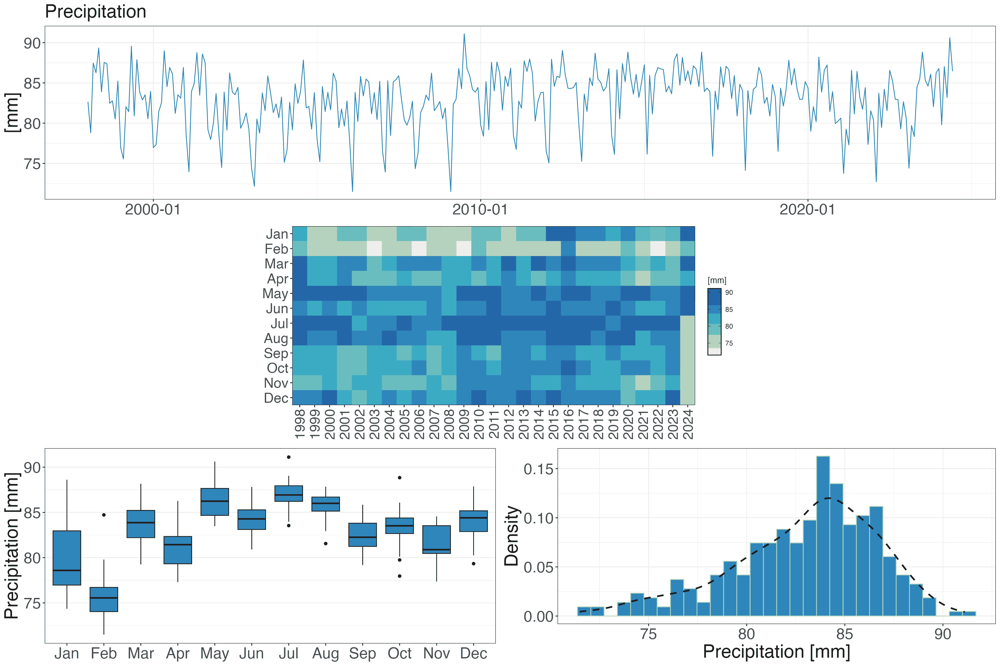

<style>
body {
text-align: justify}
</style>

***

```{r start, include = FALSE}
knitr::opts_chunk$set(
  echo = TRUE,
  eval = TRUE,
  fig.width = 7,
  warning = FALSE,
  message = FALSE
)
library(pRecipe)
library(kableExtra)
data('gpm_global_ts')
data('gpm_subset_ts')
data('gpm_cz_ts')
```

`pRecipe` was conceived back in 2020 as part of MRVG's doctoral dissertation at the Faculty of Environmental Sciences, Czech University of Life Sciences Prague, Czechia. Designed with reproducible science in mind, **`pRecipe` facilitates the download, exploration, visualization, and analysis** of multiple precipitation data products across various spatiotemporal scales.

<br>
~_The Global Water Cycle Budget_ | @vargas_godoy_global_2021

_"Like civilization and technology, our understanding of the global water cycle has been continuously evolving, and we have adapted our quantification methods to better exploit new technological resources. The accurate quantification of global water fluxes and storage is crucial in studying the global water cycle."_

***

## Before We Start

Like many other R packages, `pRecipe` has some system requirements:

* [PROJ](https://proj.org/download.html)
* Geospatial Data Abstraction Library [(GDAL)](https://gdal.org/download.html)
* Network Common Data Form [(NetCDF)](https://www.unidata.ucar.edu/software/netcdf/)

## Data

`pRecipe` database hosts 27 different precipitation data sets; seven gauge-based, eight satellite-based, seven reanalysis, and five hydrological model precipitation products. Their native specifications, as well as links to their providers, and their respective references are detailed in the following subsections. We have already homogenized, compacted to a single file, and stored them in a [Zenodo repository](https://doi.org/10.5281/zenodo.7078096) under the following naming convention:

`<data set>_<variable>_<units>_<coverage>_<start date>_<end date>_<resolution>_<time step>.nc`

The `pRecipe` data collection was homogenized to these specifications:

* `<variable>` = total precipitation (tp)
* `<units>` = millimeters (mm)
* `<resolution>` = 0.25°
* `<time step>` = monthly

E.g., GPCP v2.3 [@adler_global_2018] would be:

`gpcp_tp_mm_global_197901_202205_025_monthly.nc`

### Gauge-Based Products
```{r gauge, echo=FALSE, results = 'asis'}
tibble::tribble(
  ~"Data Set", ~"Spatial Resolution", ~Global, ~Land, ~Ocean, ~"Temporal Resolution", ~"Record Length", ~"Get Data", ~"Reference",
"CPC-Global", "0.5°", "", "x", "", "Daily", "1979/01-2022/08", "[Download](https://psl.noaa.gov/data/gridded/data.cpc.globalprecip.html)", "@xie_cpc_2010",
"CRU TS v4.06", "0.5°", "", "x", "", "Monthly", "1901/01-2021/12", "[Download](https://crudata.uea.ac.uk/cru/data/hrg/)", "@harris_version_2020",
"EM-EARTH", "0.1°", "", "x", "", "Daily", "1950/01-2019/12", "[Download](https://www.frdr-dfdr.ca/repo/dataset/8d30ab02-f2bd-4d05-ae43-11f4a387e5ad)", "@tang_em-earth_2022",
"GHCN v2", "5°", "", "x", "", "Monthly", "1900/01-2015/05", "[Download](https://psl.noaa.gov/data/gridded/data.ghcngridded.html)", "@peterson_overview_1997",
"GPCC v2020", "0.25°", "", "x", "", "Monthly", "1891/01-2022/08", "[Download](https://psl.noaa.gov/data/gridded/data.gpcc.html)", "@schneider_gpcc_2011",
"PREC/L", "0.5°", "", "x", "", "Monthly", "1948/01-2022/08", "[Download](https://psl.noaa.gov/data/gridded/data.precl.html)", "@chen_global_2002",
"UDel v5.01", "0.5°", "", "x", "", "Monthly", "1901/01-2017/12", "[Download](https://psl.noaa.gov/data/gridded/data.UDel_AirT_Precip.html)", "@willmott_terrestrial_2001"
) |>
  kbl(align = 'lcccccccr') |>
  kable_styling("striped") |>
  add_header_above(c(" " = 1, " " = 1, "Spatial Coverage" = 3, " " = 1, " " = 1, " " = 1, " " = 1)) |>
  unclass() |> cat()
```

### Satellite-Based Products

```{r satellite, echo=FALSE, results = 'asis'}
tibble::tribble(
  ~"Data Set", ~"Spatial Resolution", ~Global, ~Land, ~Ocean, ~"Temporal Resolution", ~"Record Length", ~"Get Data", ~Reference, 
"CHIRPS v2.0", "0.05°", "", "50°SN", "", "Monthly", "1981/01-2022/07", "[Download](https://www.chc.ucsb.edu/data/chirps)", "@funk_climate_2015",
"CMAP", "2.5°", "x", "x", "x", "Monthly", "1979/01-2022/07", "[Download](https://psl.noaa.gov/data/gridded/data.cmap.html)", "@xie_global_1997",
"CMORPH", "0.25°", "60°SN", "60°SN", "60°SN", "Daily", "1998/01-2021/12", "[Download](https://www.ncei.noaa.gov/data/cmorph-high-resolution-global-precipitation-estimates/)", "@joyce_cmorph_2004",
"GPCP v2.3", "0.5°", "x", "x", "x", "Monthly", "1979/01-2022/05", "[Download](https://psl.noaa.gov/data/gridded/data.gpcp.html)", "@adler_global_2018",
"GPM IMERGM v06", "0.1°", "x", "x", "x", "Monthly", "2000/06-2020/12", "[Download](https://doi.org/10.5067/GPM/IMERG/3B-MONTH/06)", "@huffman_gpm_2019",
"MSWEP v2.8", "0.1°", "x", "x", "x", "Monthly", "1979/02-2022/06", "[Download](https://www.gloh2o.org/mswep/)", "@beck_mswep_2019",
"PERSIANN-CDR", "0.25°", "60°SN", "60°SN", "60°SN", "Monthly", "1983/01-2022/06", "[Download](https://chrsdata.eng.uci.edu/)", "@ashouri_persiann-cdr_2015",
"TRMM 3B43 v7", "0.25°", "50°SN", "50°SN", "50°SN", "Monthly", "1998/01-2019/12", "[Download](https://doi.org/10.5067/TRMM/TMPA/MONTH/7)", "@huffman_trmm_2010"
) |>
  kbl(align = 'lcccccccr') |>
  kable_styling("striped") |>
  add_header_above(c(" " = 1, " " = 1, "Spatial Coverage" = 3, " " = 1, " " = 1, " " = 1, " " = 1)) |>
  unclass() |> cat()
```

### Reanalysis Products

```{r reanalysis, echo=FALSE, results = 'asis'}
tibble::tribble(
  ~"Data Set", ~"Spatial Resolution", ~Global, ~Land, ~Ocean, ~"Temporal Resolution", ~"Record Length", ~"Get Data", ~Reference,
"20CR v3", "1°", "x", "x", "x", "Monthly", "1836/01-2015/12", "[Download](https://psl.noaa.gov/data/gridded/data.20thC_ReanV3.html)", "@slivinski_towards_2019",
"ERA-20C", "1.125°", "x", "x", "x", "Monthly", "1900/01-2010/12", "[Download](https://www.ecmwf.int/en/forecasts/datasets/reanalysis-datasets/era-20c)", "@poli_era-20c_2016",
"ERA5", "0.25°", "x", "x", "x", "Monthly", "1959/01-2021/12", "[Download](https://www.ecmwf.int/en/forecasts/datasets/reanalysis-datasets/era5)", "@hersbach_era5_2020",
"JRA-55", "1.25°", "x", "x", "x", "Monthly", "1958/01-2021/12", "[Download](https://rda.ucar.edu/datasets/ds628.1/dataaccess/)", "@kobayashi_jra-55_2015",
"MERRA-2", "0.5° x 0.625°", "x", "x", "x", "Monthly", "1980/01-2023/01", "[Download](https://disc.gsfc.nasa.gov/datasets?page=1&project=MERRA-2)", "@gelaro_modern-era_2017",
"NCEP/NCAR R1", "1.875°", "x", "x", "x", "Monthly", "1948/01-2022/08", "[Download](https://psl.noaa.gov/data/gridded/data.ncep.reanalysis.derived.html)", "@kalnay_ncepncar_1996",
"NCEP/DOE R2", "1.875°", "x", "x", "x", "Monthly", "1979/01-2022/08", "[Download](https://psl.noaa.gov/data/gridded/data.ncep.reanalysis2.html)", "@kanamitsu_ncepdoe_2002"
) |>
  kbl(align = 'lcccccccr') |>
  kable_styling("striped") |>
  add_header_above(c(" " = 1, " " = 1, "Spatial Coverage" = 3, " " = 1, " " = 1, " " = 1, " " = 1)) |>
  unclass() |> cat()
```

### Hydrological Model Forcing

```{r models, echo=FALSE, results = 'asis'}
tibble::tribble(
  ~"Data Set", ~"Spatial Resolution", ~Global, ~Land, ~Ocean, ~"Temporal Resolution", ~"Record Length", ~"Get Data", ~Reference,
"FLDAS", "0.1°", "", "x", "", "Monthly", "1982/01-2021/12", "[Download](https://ldas.gsfc.nasa.gov/fldas/fldas-data-download)", "@mcnally_land_2017",
"GLDAS CLSM v2.0", "0.25°", "", "x", "", "Daily", "1948/01-2014/12", "[Download](https://ldas.gsfc.nasa.gov/gldas/gldas-get-data)", "@rodell_global_2004",
"GLDAS NOAH v2.0", "0.25°", "", "x", "", "Monthly", "1948/01-2014/12", "[Download](https://ldas.gsfc.nasa.gov/gldas/gldas-get-data)", "@rodell_global_2004",
"GLDAS VIC v2.0", "1°", "", "x", "", "Monthly", "1948/01-2014/12", "[Download](https://ldas.gsfc.nasa.gov/gldas/gldas-get-data)", "@rodell_global_2004",
"TerraClimate", "4$km$", "", "x", "", "Monthly", "1958/01-2021/12", "[Download](https://www.climatologylab.org/terraclimate.html)", "@abatzoglou_terraclimate_2018"
) |>
  kbl(align = 'lcccccccr') |>
  kable_styling("striped") |>
  add_header_above(c(" " = 1, " " = 1, "Spatial Coverage" = 3, " " = 1, " " = 1, " " = 1, " " = 1)) |>
  unclass() |> cat()
```

# Recipe

In this introductory recipe we will first download the GPM-IMERGM data set. We will then subset the downloaded data over Central Europe for the 2001-2010 period, and crop it to the national scale for Czechia. In the next step, we will generate time series for our data sets and conclude with the visualization of our data.

**NOTE:** While the functions in `pRecipe` are intended to work directly with its data inventory. It can handle most other precipitation data sets in ".nc" format, as well as any other ".nc" file generated by its functions.

## Installation

```{r install, eval = FALSE}
install.packages('pRecipe')
library(pRecipe)
```

## Download

Downloading the entire data collection or only a few data sets is quite straightforward. You just call the `download_data` function, which has four arguments *data_name*, *path*, *domain*, and *time_res*.

* *data_name* is set to "all" by default, but you can specify the names of your data sets of interest only.
* *path* is set to "." by default. I.e., the current working directory. By replacing it for [your_project_folder], the downloaded files will be stored in [your_project_folder] instead.
* *domain* is set to "raw" by default, but you can specify the domain of your interest only. E.g., "ocean" for ocean only data sets (For availability please check the [Data] section). 
* *time_res* is set to "monthly" by default, but if you prefer you can also download annual data with "yearly".

Let's download the GPM-IMERGM data set and inspect its content with `show_info`:

```{r download, eval = FALSE}
download_data(data_name = 'gpm-imerg')
gpm_global <- raster::brick('gpm-imerg_tp_mm_global_200006_202012_025_monthly.nc')
show_info(gpm_global)
```

```
[1] "class      : RasterBrick "                                         
[2] "dimensions : 720, 1440, 1036800, 247  (nrow, ncol, ncell, nlayers)"
[3] "resolution : 0.25, 0.25  (x, y)"
[4] "extent     : -180, 180, -90, 90  (xmin, xmax, ymin, ymax)"
[5] "crs        : +proj=longlat +datum=WGS84 "
[6] "source     : gpm-imerg_tp_mm_global_200006_202012_025_monthly.nc "
[7] "names      : X2000.06.01, X2000.07.01, X2000.08.01, X2000.09.01, X2000.10.01, X2000.11.01, X2000.12.01, X2001.01.01, X2001.02.01, X2001.03.01, X2001.04.01, X2001.05.01, X2001.06.01, X2001.07.01, X2001.08.01, ... "
[8] "Date/time  : 2000-06-01, 2020-12-01 (min, max)"
[9] "varname    : tp " 
```

## Processing

Once we have downloaded our database, we can start processing the data with:

* `subset_spacetime` to subset the data in time and space.
* `subset_space` to subset the data to the region of interest.
* `subset_time` to select the years of interest.
* `mon_to_year` to aggregate the data from monthly into annual.
* `rescale_data` to go from the native resolution (0.25°) to coarser ones (e.g., 0.5°, 1°, 1.5°, 2°, etc).
* `make_ts` to generate a time series by taking the area weighted average over each time step.

### Subset

To subset our data to a desired region and period of interest, we use the `subset_spacetime` function, which has four arguments *data*, *years*, *bbox*, and *autosave*.

* *data* is the path to the data set of interest or a RasterBrick object.
* *years* is the period of interest in the form (start_year, end_year)
* *bbox* is the bounding box of the region of interest with the coordinates in degrees in the form (xmin, xmax, ymin, ymax).
* *autosave* is set to FALSE by default. If TRUE data will be automatically stored in the same location of the input file.

Let's subset the GPM-IMERGM data set over Central Europe (2,28,42,58) for the 2001-2010 period, and inspect its content with `show_info`:

```{r subset, eval = FALSE}
gpm_subset <- subset_spacetime(gpm_global, years = c(2001, 2010), bbox = c(2,28,42,58))
show_info(gpm_subset)
```

```
[1] "class      : RasterBrick "
[2] "dimensions : 64, 104, 6656, 120  (nrow, ncol, ncell, nlayers)"
[3] "resolution : 0.25, 0.25  (x, y)"
[4] "extent     : 2, 28, 42, 58  (xmin, xmax, ymin, ymax)"
[5] "crs        : +proj=longlat +datum=WGS84 "
[6] "source     : memory"
[7] "names      : X2001.01.01,  X2001.02.01,  X2001.03.01,  X2001.04.01,  X2001.05.01,  X2001.06.01,  X2001.07.01,  X2001.08.01,  X2001.09.01,  X2001.10.01,  X2001.11.01,  X2001.12.01,  X2002.01.01,  X2002.02.01,  X2002.03.01, ... "
[8] "min values : 1.272205e+01, 4.698483e+00, 5.927317e+00, 2.240815e+00, 1.315575e+01, 1.301118e+00, 3.831070e+00, 4.547474e-13, 2.739577e+01, 1.662540e+00, 2.002276e+01, 1.084265e+00, 4.843051e+00, 3.975639e+00, 5.638179e+00, ... "
[9] "max values :     443.4645,     158.5196,     374.7221,     229.5028,     163.2903,     251.5495,     330.9900,     336.4113,     456.0420,     454.0903,     452.1386,     236.0807,     277.7888,     255.8143,     195.8183, ... "
[10] "time       : 2001-01-01, 2010-12-01 (min, max)"
```

### Crop

To further crop our data to a desired polygon other than a rectangle, we use the `crop_data` function, which has three arguments *x*, *shp_path*, *autosave*.

* *x* is the path to a ".nc" data set file or a RasterBrick object.
* *shp_path* is the path to a ".shp" file that we want to use to crop our data.
* *autosave* is set to FALSE by default. If TRUE data will be automatically stored in the same location of the input file.


Let's crop our GPM-IMERG subset to cover only Czechia with the respective [shape file](https://geodata.ucdavis.edu/gadm/gadm4.1/shp/gadm41_CZE_shp.zip), and inspect its content with `show_info`:

```{r crop, eval = FALSE}
gpm_cz <- crop_data(x = gpm_subset, shp_path = "gadm41_CZE_0.shp")
show_info(gpm_cz)
```

```
[1] "class      : RasterBrick "
[2] "dimensions : 64, 104, 6656, 480  (nrow, ncol, ncell, nlayers)"
[3] "resolution : 0.25, 0.25  (x, y)"
[4] "extent     : 2, 28, 42, 58  (xmin, xmax, ymin, ymax)"
[5] "crs        : +proj=longlat +datum=WGS84 "
[6] "source     : memory"
[7] "names      : X2001.01.01, X2001.02.01, X2001.03.01, X2001.04.01, X2001.05.01, X2001.06.01, X2001.07.01, X2001.08.01, X2001.09.01, X2001.10.01, X2001.11.01, X2001.12.01, X2002.01.01, X2002.02.01, X2002.03.01, ... "
[8] "min values :   43.226040,   30.070290,   65.995613,   46.767975,   44.382591,   52.406155,   83.416138,   51.177319,   88.692894,   14.673723,   49.876202,   55.442097,   21.179314,   57.682911,   33.612221, ... "
[9] "max values :    89.99401,    70.54952,   158.95328,   106.25800,    90.21087,   135.75002,   248.73044,   138.78595,   158.15816,    51.39417,   113.63100,   141.96646,    77.34425,   162.56750,   132.85863, ... "
[10] "time       : 2001-01-01, 2010-12-01 (min, max)"
```

### Generate Time series

To make a time series out of our data, we use the `make_ts` function, which has three arguments *data*, *name*, and *autosave*.

* *data* is the path to a ".nc" data set file or a RasterBrick object.
* *name* is the short name of a data set. E.g., 'gpm-imerg'.
* *autosave* is set to FALSE by default. If TRUE data will be automatically stored in the same location of the input file.

Let's generate the time series for our three different GPM-IMERGM data sets (Global, Central Europe, and Czechia), and inspect its first 12 rows:

```{r global_ts, eval=FALSE}
gpm_global_ts <- make_ts(gpm_global, 'gpm-imerg')
head(gpm_global_ts, 12)
```

```
          date     value           name            type
 1: 2000-06-01  93.60162 GPM IMERGM v06 Satellite-based
 2: 2000-07-01  96.01442 GPM IMERGM v06 Satellite-based
 3: 2000-08-01  94.16792 GPM IMERGM v06 Satellite-based
 4: 2000-09-01  90.38524 GPM IMERGM v06 Satellite-based
 5: 2000-10-01  93.90120 GPM IMERGM v06 Satellite-based
 6: 2000-11-01  93.55994 GPM IMERGM v06 Satellite-based
 7: 2000-12-01  96.68792 GPM IMERGM v06 Satellite-based
 8: 2001-01-01  94.71431 GPM IMERGM v06 Satellite-based
 9: 2001-02-01  85.94786 GPM IMERGM v06 Satellite-based
10: 2001-03-01  96.12793 GPM IMERGM v06 Satellite-based
11: 2001-04-01  96.99244 GPM IMERGM v06 Satellite-based
12: 2001-05-01 100.50446 GPM IMERGM v06 Satellite-based
```

```{r subset_ts, eval=FALSE}
gpm_subset_ts <- make_ts(gpm_subset, 'gpm-imerg')
head(gpm_subset_ts, 12)
```

```
          date     value           name            type
 1: 2001-01-01  96.67884 GPM IMERGM v06 Satellite-based
 2: 2001-02-01  58.80170 GPM IMERGM v06 Satellite-based
 3: 2001-03-01  96.04202 GPM IMERGM v06 Satellite-based
 4: 2001-04-01  80.09136 GPM IMERGM v06 Satellite-based
 5: 2001-05-01  55.94958 GPM IMERGM v06 Satellite-based
 6: 2001-06-01  92.74124 GPM IMERGM v06 Satellite-based
 7: 2001-07-01  95.06115 GPM IMERGM v06 Satellite-based
 8: 2001-08-01  76.70639 GPM IMERGM v06 Satellite-based
 9: 2001-09-01 141.68700 GPM IMERGM v06 Satellite-based
10: 2001-10-01  62.51384 GPM IMERGM v06 Satellite-based
11: 2001-11-01  97.12927 GPM IMERGM v06 Satellite-based
12: 2001-12-01  71.00100 GPM IMERGM v06 Satellite-based
```

```{r cz_ts, eval=FALSE}
gpm_cz_ts <- make_ts(gpm_cz, 'gpm-imerg')
head(gpm_cz_ts, 12)
```

```
          date     value           name            type
 1: 2001-01-01  59.36666 GPM IMERGM v06 Satellite-based
 2: 2001-02-01  50.59915 GPM IMERGM v06 Satellite-based
 3: 2001-03-01  96.69115 GPM IMERGM v06 Satellite-based
 4: 2001-04-01  73.23477 GPM IMERGM v06 Satellite-based
 5: 2001-05-01  64.74244 GPM IMERGM v06 Satellite-based
 6: 2001-06-01  86.48493 GPM IMERGM v06 Satellite-based
 7: 2001-07-01 127.52908 GPM IMERGM v06 Satellite-based
 8: 2001-08-01  94.31304 GPM IMERGM v06 Satellite-based
 9: 2001-09-01 119.28491 GPM IMERGM v06 Satellite-based
10: 2001-10-01  30.82040 GPM IMERGM v06 Satellite-based
11: 2001-11-01  72.33474 GPM IMERGM v06 Satellite-based
12: 2001-12-01  91.77480 GPM IMERGM v06 Satellite-based
```

## Visualize

Either after we have processed our data as required or right after downloaded, we have different options to visualize our data:

* `plot_taylor` to see a Taylor Diagram (requires a referential data set).
* `plot_map` to see the Cartesian lon-lat map of the first raster layer.
* `plot_line` to see the average time series.
* `plot_heatmap` to see a heatmap of all monthly values.
* `plot_box` to see a seasonal boxplot.
* `plot_density` to see the empirical density of monthly precipitation.
* `plot_summary` to see line, heatmap, box, and density plot together in a single plot.

Let's plot our three different GPM-IMERGM data sets (Global, Central Europe, and Czechia)

### Maps

To see a map of any data set raw or processed, we use `plot_map` which takes only one layer of the RasterBrick as input.

```{r map_global, eval = FALSE}
plot_map(gpm_global[[1]])
```

{width=90%}

```{r map_subset, eval = FALSE}
plot_map(gpm_subset[[1]])
```

{width=90%}

```{r map_cz, eval = FALSE}
plot_map(gpm_cz[[1]])
```

{width=90%}

### Time Series Visuals

To draw a time series generated by `make_ts`, we use any of the options below, which takes only a `make_ts` ".csv" generated file.

#### Line

```{r}
plot_line(gpm_global_ts)
plot_line(gpm_subset_ts)
plot_line(gpm_cz_ts)
```

#### Heatmap

```{r}
plot_heatmap(gpm_global_ts)
plot_heatmap(gpm_subset_ts)
plot_heatmap(gpm_cz_ts)
```

#### Boxplot

```{r}
plot_box(gpm_global_ts)
plot_box(gpm_subset_ts)
plot_box(gpm_cz_ts)
```

#### Density

```{r}
plot_density(gpm_global_ts)
plot_density(gpm_subset_ts)
plot_density(gpm_cz_ts)
```

#### Summary

**NOTE:** For good aesthetics we recommend saving `plot_summary` with `ggsave(<filename>, <plot>, width = 16.3, height = 15.03)`.

```{r, eval=FALSE}
plot_summary(gpm_global_ts)
#plot_summary(gpm_subset_ts)
#plot_summary(gpm_cz_ts)
```

{width=95%}


## Time Series Analysis

Once we have generated our time series, we can start evaluating the data with:

* `pod` to calculate the probability of detection.
* `far` to calculate the false alarm rate.
* `csi` to calculate the critical success index.
* `nse` to calculate the Nash–Sutcliffe efficiency.

The above functions have three arguments *x*, *ref*, and *th* (except for `nse`).

* *x* is the time series data.table generated by `make_ts`.
* *ref* is a data.table time series with the referential data used for evaluation.
* *th* is the number to be used as the detection threshold.

**NOTE:** Not demonstrated in the current demo because such metrics are not intended for monthly data but rather higher temporal resolution data, e.g., daily or subdaily (coming soon).

# Coming Soon

More functions for data processing and analysis and expanding the database.

# References
